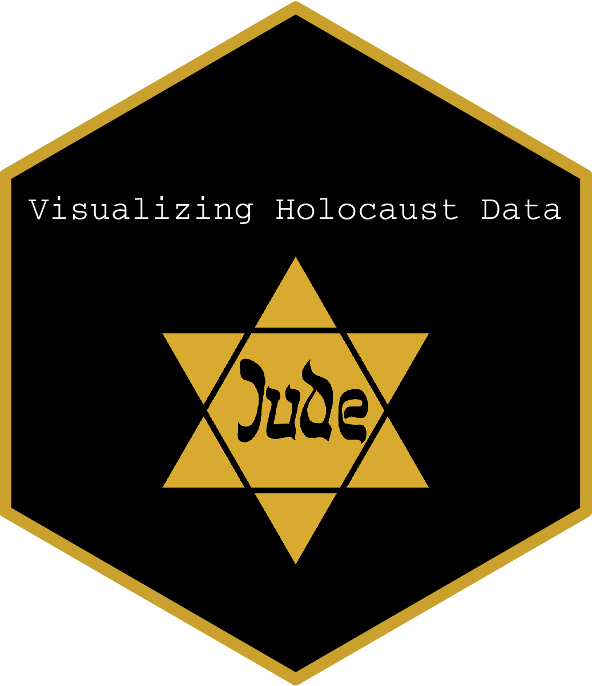

<!-- README.md is generated from README.Rmd. Please edit that file -->

```{r, include = FALSE}
knitr::opts_chunk$set(
  collapse = TRUE,
  comment = "#>",
  fig.path = "man/figures/README-",
  out.width = "100%"
)
```

# 

# Welcome to the code that creates the Holocaust shiny app

## The website can be reached by going to this URl: https://naomigiancola01.shinyapps.io/holocaustshinyapp/


In this repository you will find the holocaustshiny folder. It contains a data folder in the main folder and the code for the shiny app in app.R. 

You will also find the folder: rsconnect/shinyapps.io/naomigiancola01. This is the code that publishes the website.
